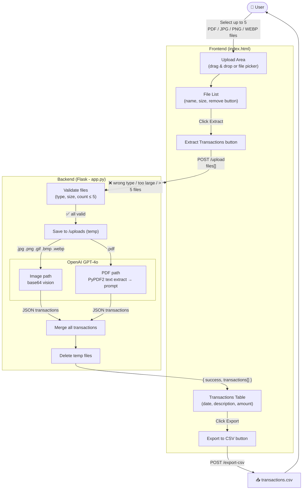

# Spensy - Statement Parser & Transaction Extractor

Spensy is a web app that extracts financial transactions from bank statement screenshots or PDFs using OpenAI's GPT-4o vision model, and exports them to CSV.

---

## How It Works

---

## Functionality

### File Upload
- Drag and drop or click to browse
- Supports **JPG, PNG, GIF, BMP, WEBP** (images) and **PDF**
- Up to **5 files** per request
- Per-file size limit: **50 MB**
- Duplicate file detection (by name + size)
- Individual file removal before processing

### Transaction Extraction
- **Images** — sent to GPT-4o as base64 vision input
- **PDFs** — text extracted with PyPDF2, then sent to GPT-4o as a text prompt
- GPT-4o returns structured JSON with `date`, `description`, and `amount` for each transaction
- Transactions from all uploaded files are merged into a single result

### Results Display
- Transactions shown in a table with date, description, and amount
- Total count shown, e.g. "12 transactions across 2 files"

### CSV Export
- One-click export of all extracted transactions to a timestamped CSV file

---

## Stack

| Layer | Technology |
|-------|-----------|
| Frontend | HTML, CSS, Vanilla JS |
| Backend | Python, Flask |
| AI Extraction | OpenAI GPT-4o |
| PDF Parsing | PyPDF2 |
| Config | python-dotenv |
