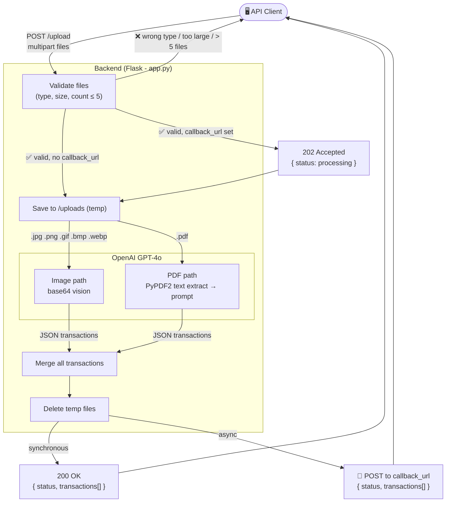

# Spensy - Statement Parser API

Spensy is a REST API that extracts financial transactions from bank statement images or PDFs using OpenAI's GPT-4o vision model. Upload up to 5 files and receive structured JSON — either synchronously in the response, or asynchronously via a callback URL.

---

## How It Works



---

## API Reference

Base URL: `http://localhost:5050`

---

### `POST /upload`

Upload one or more statement files for transaction extraction.

**Request** — `multipart/form-data`

| Field | Type | Required | Description |
|-------|------|----------|-------------|
| `files` | file (repeatable) | Yes | Statement files to process. Up to 5 files per request. Supported types: `PDF`, `JPG`, `JPEG`, `PNG`, `GIF`, `BMP`, `WEBP`. Max 50 MB per file. |
| `callback_url` | string | No | If provided, the server responds immediately with `202` and POSTs the results to this URL when processing completes. |

---

#### Synchronous mode (no `callback_url`)

Returns `200 OK` with extracted transactions once processing is complete.

**Response**

```json
{
  "status": "completed",
  "files_processed": 2,
  "transaction_count": 15,
  "transactions": [
    {
      "date": "2024-01-15",
      "description": "AMAZON RETAIL",
      "amount": "1299.00"
    },
    {
      "date": "2024-01-16",
      "description": "SWIGGY",
      "amount": "348.50"
    }
  ]
}
```

**Example**

```bash
# Single file
curl -X POST http://localhost:5050/upload \
  -F "files=@/path/to/statement.jpg"

# Multiple files
curl -X POST http://localhost:5050/upload \
  -F "files=@/path/to/statement1.pdf" \
  -F "files=@/path/to/statement2.png"
```

---

#### Async mode (with `callback_url`)

Returns `202 Accepted` immediately. Results are POSTed to the `callback_url` when processing finishes.

**Immediate response** — `202 Accepted`

```json
{
  "status": "processing",
  "message": "Files received. Results will be POSTed to your callback URL when processing completes."
}
```

**Callback payload** (POSTed to your `callback_url`) — on success:

```json
{
  "status": "completed",
  "files_processed": 1,
  "transaction_count": 12,
  "transactions": [
    {
      "date": "2024-01-15",
      "description": "AMAZON RETAIL",
      "amount": "1299.00"
    }
  ]
}
```

**Callback payload** — on processing error:

```json
{
  "status": "error",
  "message": "An error occurred while processing the uploaded files."
}
```

**Example**

```bash
curl -X POST http://localhost:5050/upload \
  -F "files=@/path/to/statement.pdf" \
  -F "callback_url=https://your-server.com/webhook"
```

> Tip: Use [webhook.site](https://webhook.site) to get a free temporary URL to inspect the callback payload during development.

---

#### Error responses

| HTTP Status | Cause |
|-------------|-------|
| `400` | No files provided, more than 5 files, unsupported file type, or file exceeds 50 MB |
| `500` | Unexpected server error during processing |

**Example error response**

```json
{
  "error": "Maximum 5 files allowed at once"
}
```

---

### `GET /health`

Health check endpoint.

**Response** — `200 OK`

```json
{
  "status": "healthy"
}
```

**Example**

```bash
curl http://localhost:5050/health
```

---

## Transaction Object

Each transaction in the `transactions` array has these fields:

| Field | Type | Description |
|-------|------|-------------|
| `date` | string | ISO 8601 date (`YYYY-MM-DD`) |
| `description` | string | Merchant name or transaction description |
| `amount` | string | Numeric amount without currency symbol (e.g. `"1299.00"`) |

---

## Setup

**1. Clone and create a virtual environment**

```bash
git clone <repo-url>
cd spensy
python -m venv venv
source venv/bin/activate  # Windows: venv\Scripts\activate
```

**2. Install dependencies**

```bash
pip install -r requirements.txt
```

**3. Configure environment**

Create a `.env` file in the project root:

```
OPENAI_API_KEY=sk-...
```

**4. Run the server**

```bash
python app.py
```

Server starts at `http://localhost:5050`.

---

## Stack

| Layer | Technology |
|-------|-----------|
| Backend | Python, Flask |
| AI Extraction | OpenAI GPT-4o |
| PDF Parsing | PyPDF2 |
| HTTP Callbacks | requests |
| Config | python-dotenv |
